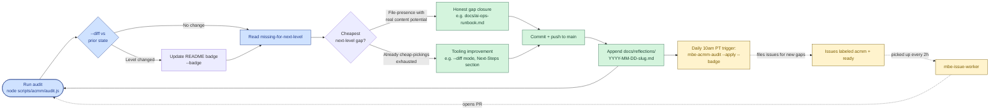

# ACMM — AI Codebase Maturity Model

How this repo measures and improves how AI-operable it is over time.

## What ACMM scores

ACMM is a 6-level rubric for how well a codebase is set up to be **driven by
AI agents** rather than just edited by them. It evaluates the **meta-properties**
of the repo — instructions, metrics, loops, gates, autonomy — not the
quality of the application code itself.

The catalog (89 criteria across 4 cited frameworks) is ported verbatim from
[kubestellar/console](https://github.com/kubestellar/console/tree/main/web/src/lib/acmm/sources),
the reference implementation validated in [arXiv:2604.09388](https://arxiv.org/abs/2604.09388).
Source IDs and detection paths are 1:1 with upstream — verified by diff.

| Source | Criteria |
|---|---|
| [AI Codebase Maturity Model](https://arxiv.org/abs/2604.09388) | 66 |
| [Fullsend](https://github.com/fullsend-ai/fullsend) | 9 |
| [Agentic Engineering Framework](https://github.com/DimitriGeelen/agentic-engineering-framework) | 7 |
| [Claude Reflect](https://github.com/BayramAnnakov/claude-reflect) | 7 |

## The 6 levels

| L | Name | Role | Characteristic |
|---|---|---|---|
| 1 | Assisted / Ad Hoc | Executor | AI used opportunistically; no project-specific config |
| 2 | Instructed | Rule-writer | AI receives project context through committed files |
| 3 | Measured / Enforced | Analyst | Rules mechanically enforced; AI loop instrumented |
| 4 | Adaptive / Structured | Governor | Workflows are structured and environment-aware |
| 5 | Semi-Automated | Operator | System detects + proposes; humans approve |
| 6 | Fully Autonomous | Strategist | System acts; humans audit after the fact |

L0 (Prerequisites) is a **soft indicator** — basic engineering hygiene (test
suite, CI/CD, contributing guide) — not part of the level threshold walk.

**Threshold rule:** each level needs **≥70% of its scannable criteria detected**
to advance. L2 is special — needs only 1 (it's a single OR-group of agent-instruction files).

## Where this repo currently is

The current level is shown in the README badge between the
`<!-- acmm:begin -->` / `<!-- acmm:end -->` markers, kept in sync by the
audit script.

Live state lives at `.claude/acmm/state.json` and the human-readable
scorecard at `.claude/acmm/report.md` (both gitignored — they're
locally-derived from the source tree).

## How the audit works

```bash
# Dry run — score the repo, write report, create nothing
node scripts/acmm/audit.js

# Score a specific sub-project (app or package)
node scripts/acmm/audit.js --project apps/marketing

# + create deduplicated GitHub issues for next-level gaps
node scripts/acmm/audit.js --apply

# + rewrite README badge between <!-- acmm:begin -->/<!-- acmm:end -->
node scripts/acmm/audit.js --badge

# Full run (what scheduled trigger calls)
node scripts/acmm/audit.js --apply --badge

# Print trend history only
node scripts/acmm/audit.js --trend
```

## Monorepo vs Package implementation

ACMM can be run at the root of the monorepo or scoped to a specific project using the `--project <path>` flag.

### Inheritance logic

Sub-projects can inherit global ACMM signals from the repo root (like CI/CD workflows or contributing guides) by configuring the `acmm` field in their `package.json`:

```json
{
  "name": "@mbe/marketing",
  "acmm": {
    "inherit": true
  }
}
```

When `inherit: true` is set:
1. The audit first checks the project directory for the criterion.
2. If not found locally, it checks if the criterion's detection patterns are part of the `globalPaths` allowlist.
3. If allowed, it checks the repo root for the signal.

**Local-only criteria:** Certain criteria (like `CLAUDE.md` instructions, `llms.txt`, or `AGENTS.md`) MUST be present locally in the project directory to be detected, even if inheritance is enabled. This ensures every project has its own local context for AI agents.

### Global Paths (Defaults)
By default, the following paths are considered global and can be inherited:
- `.github/` (Workflows, templates)
- `docs/` (Runbooks, maturity model docs)
- `scripts/acmm/` (Audit tools)
- `CONTRIBUTING.md`
- `package.json`, `pnpm-workspace.yaml`, `turbo.json` (Monorepo config)

## Internally:

1. Loads 89 criteria from `scripts/acmm/sources/{acmm,fullsend,agentic-engineering-framework,claude-reflect}.js`.
2. Runs file-presence detection on each (no network, native `fs` only):
   - `path` — single file or directory; trailing `/` requires a directory
   - `any-of` — array of paths; ANY match satisfies
3. Computes the level via threshold walk.
4. Writes `.claude/acmm/state.json` (full computation) and `.claude/acmm/report.md` (scorecard).
5. With `--apply`, files GitHub issues only for **next-level gaps** — dedupes via `state.issuesCreated[criterionId]` so re-runs don't spam.
6. With `--badge`, rewrites the README shields.io badge in place.

The audit always shows a **"since last run" diff** at the top of both
the console output and `report.md`: level delta, count delta, and the
literal criterion IDs that flipped to detected or regressed. This is the
direct signal for "did this iteration of work move the needle."

## How we improve over time

A pattern emerged from running the continuous-improvement loop on this
repo: **each iteration produces one tooling improvement plus one honest
gap closure.** The tooling improvement compounds — the next iteration's
gap closure is easier to spot because the previous iteration sharpened
the signal.

This is a default rhythm, not a rule. When N small honest gaps all sit
behind a single level threshold (closing 3 of them produces no
observable system change, but closing the 4th promotes the level),
batching them in one iteration is correct — the iteration's coherence
comes from the level promotion, not from doing one thing at a time.
What never changes: each artifact must have real content satisfying
the criterion's underlying need, not just file-presence theater. See
[reflections/2026-04-25-batch-when-honest-and-coherent.md](./reflections/2026-04-25-batch-when-honest-and-coherent.md).



Three colors map to the three layers: **blue** is the human/audit feedback
loop, **green** is the work shipped this iteration, **yellow** is the
autonomous catch-up loop that runs without you (scheduled trigger →
issue → agent → PR → next audit).

Concrete examples from the L3→L5 climb:

| Iteration | Tooling shipped | Gap closed |
|---|---|---|
| Lead with Next-Steps | Hoisted next-level gaps to top of `report.md` with concrete `touch <file>` / `mkdir -p <dir>` hints | (none — pure tooling) |
| Reflections as convention | Established `docs/reflections/` format with frontmatter for `feeds_back_into:` | `acmm:reflection-log` (L4 → L5 promotion) |
| --diff signal | Auto-detected delta vs prior saved state in console + report | `acmm:observability-runbook` (L6 0/6 → 1/6) via `docs/ai-ops-runbook.md` |

The principle: **never close a gap with empty-file theater.** A criterion
exists because the file or directory has a real purpose. If you can't
honestly write the content, the gap stays open. Reading the criterion's
`details:` field tells you the underlying need.

### Anti-pattern at each level

Each level has a documented anti-pattern that often appears just before
the next-level transition trigger fires. The audit surfaces these:

- **L4 anti-pattern:** Policy theater — auto-tuning thresholds without a human-readable explanation of why they changed.
- **L5 anti-pattern:** Alert fatigue — generating proposals no one reviews.
- **L6 transition trigger:** "I want the system to act on what it finds, not just propose."

If you notice the anti-pattern showing up, that's the cue to stop adding
features at the current level and start moving up.

## Scheduled audit

Runs daily at **10:00 AM PT** via the `mbe-acmm-audit` RemoteTrigger:

```
node scripts/acmm/audit.js --apply --badge
```

This:
1. Re-runs detection on every commit landed since the last run.
2. Files GitHub issues for any new next-level gaps (label `acmm`, label `ready`).
3. Updates the README badge if the level changed.

The agent-issue-worker (`mbe-issue-worker`, every 2h) then picks up the
`ready`-labeled gap issues and tries to close them.

## Reflection log

`docs/reflections/` is the committed record of lessons learned from
running the loop — one file per lesson with frontmatter declaring which
instruction file it `feeds_back_into:`. This is itself one of the L5
criteria (`acmm:reflection-log`); the convention is documented in
`docs/reflections/README.md`.

Reflections are not changelogs and not tutorials. They capture the
moments when "running the code told me something I didn't know from
reading the code." They feed back into instruction files (CLAUDE.md,
SKILL.md, etc.) so future sessions start smarter than the last one.

## Related artifacts

| Artifact | Purpose |
|---|---|
| `.claude/skills/acmm-audit/SKILL.md` | Slash-command interface (`/acmm-audit`) |
| `scripts/acmm/audit.js` | The audit runner |
| `scripts/acmm/sources/*.js` | The 89-criterion catalog (1:1 port of upstream) |
| `scripts/acmm/computeLevel.js` | Threshold walk + missing-for-next-level computation |
| `scripts/acmm/outputs/{report,badge,issues}.js` | Output renderers |
| `.claude/acmm/state.json` | Last run state (gitignored, locally derived) |
| `.claude/acmm/report.md` | Scorecard (gitignored, locally derived) |
| `metrics/acmm-pr-history.jsonl` | PR-history backfill for trend analysis |
| `docs/reflections/` | Lessons-learned committed log |
| `docs/ai-ops-runbook.md` | How to debug/override the autonomous systems |

## Adding a new criterion

We don't extend the canonical 89-criterion catalog locally — that would
break upstream parity. Instead:

1. Open an issue or PR upstream at [kubestellar/console](https://github.com/kubestellar/console).
2. Once it lands, port the new criterion into the matching `scripts/acmm/sources/<source>.js` file.
3. Re-run `node scripts/acmm/audit.js` to confirm parity (89 → 90).

For repo-specific quality gates that aren't part of ACMM, use the
existing systems: `/site-audit` for UX/perf, `/ci-monitor` for CI
health, ADRs in `docs/adr/` for architectural decisions.
