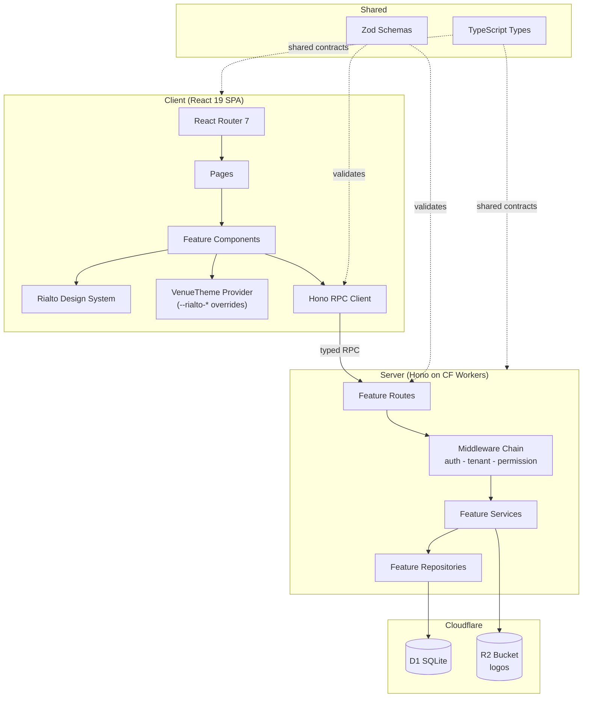
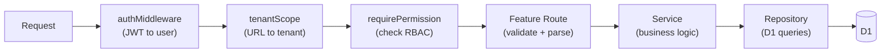
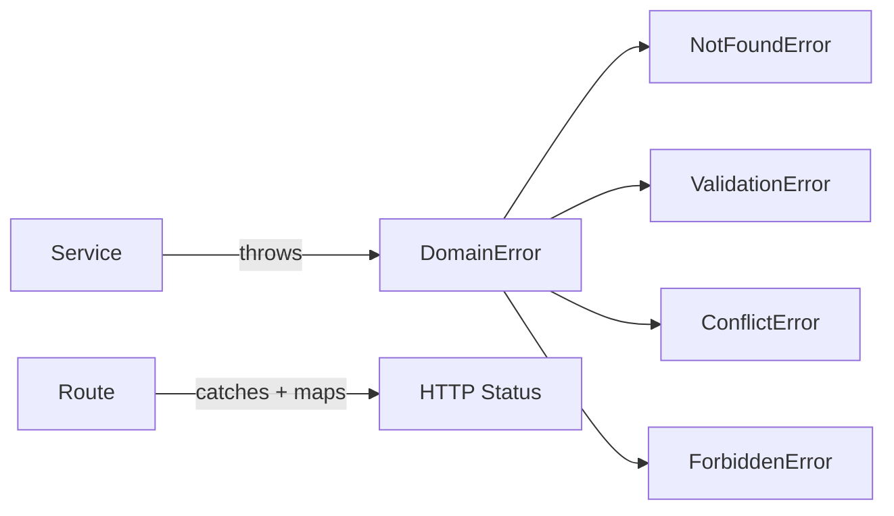
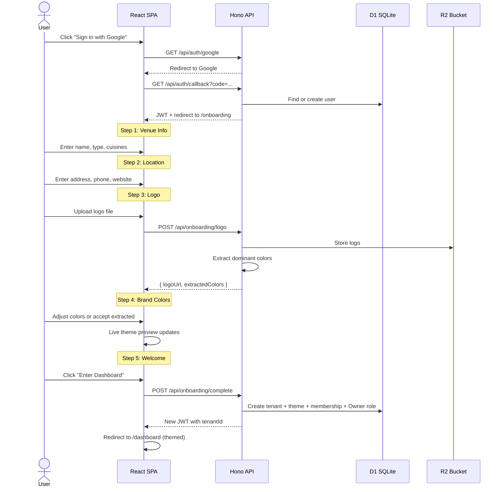

# Eat Sheet: Onboarding Flow Design

**Date:** 2026-04-13
**Status:** Draft
**Scope:** Auth + venue onboarding wizard + per-venue theming

---

## Context

Eat-sheet is a multi-tenant SaaS hospitality platform for restaurants (FOH operations: reservations, waitlist, floor plans, guest profiles). V1 completed all 54 requirements but the codebase was wiped for a fresh start with a focus on **quality and exceptional UI**.

This spec covers the first piece: authentication via Google OAuth and a 5-step onboarding wizard that creates a fully-themed venue. Every subsequent feature builds on the auth, tenancy, and theming infrastructure established here.

---

## Decisions

| Decision | Choice | Rationale |
|----------|--------|-----------|
| Platform | Cloudflare (Workers + D1 + R2) | Existing account, cheap, edge-deployed, serverless |
| Framework | Hono + React 19 SPA | Proven in v1, simple, full control |
| Design system | Rialto (`@mattbutlerengineering/rialto`) | Own design system, CSS custom properties enable per-venue theming, 70+ components |
| Styling | Rialto CSS Modules + `--rialto-*` tokens | Material honesty, warm neutrals, gold accent, spring physics |
| Validation | Zod (shared client + server) | Schema-based, single source of truth |
| API client | Hono RPC (`hc`) | Type-safe client generated from route types, zero extra code |
| Auth | Google OAuth via Arctic + JWT (hono/jwt) | Same as v1, proven |

---

## Tech Stack

| Layer | Technology |
|-------|-----------|
| Server | Hono on Cloudflare Workers |
| Client | React 19 + React Router 7 (SPA mode) |
| Design system | `@mattbutlerengineering/rialto` |
| Animation | Framer Motion (Rialto peer dep) |
| Icons | Lucide React (Rialto peer dep) |
| Database | Cloudflare D1 (SQLite) |
| Object storage | Cloudflare R2 (`eat-sheet-logos` bucket) |
| Auth | Google OAuth via Arctic, JWT via hono/jwt |
| Validation | Zod |

---

## Architecture

### System Overview



### Request Flow



---

## Project Structure

```
eat-sheet.com/
  src/
    server/
      features/
        auth/
          routes.ts           # Google OAuth + JWT endpoints
          middleware.ts        # JWT validation, tenant scope
          types.ts             # AuthUser, Session
        venues/
          routes.ts           # Venue CRUD + onboarding endpoints
          service.ts          # Creation logic, theme extraction
          repository.ts       # D1 queries for tenants, themes
          schema.ts           # Zod validation schemas
          types.ts            # Venue, VenueTheme, CuisineType
      db/
        schema.sql            # Full D1 schema
        migrations/           # Numbered migration files
      errors.ts               # Base domain error classes
      index.ts                # Hono app entry, mounts features
    client/
      features/
        onboarding/
          components/
            StepVenueInfo.tsx  # Name, type, cuisines
            StepLocation.tsx   # Address, phone, website
            StepLogo.tsx       # Logo upload + preview
            StepBrand.tsx      # Color picker + live theme preview
            StepWelcome.tsx    # Themed dashboard preview + CTA
          hooks/
            useOnboarding.ts   # Wizard state machine
          index.ts             # Public barrel
      api/
        client.ts             # Hono RPC client (typed)
      providers/
        VenueTheme.tsx        # Extends Rialto UIEnvironment with venue tokens
      pages/
        Login.tsx
        Onboarding.tsx        # Wizard container
        Dashboard.tsx         # Post-onboarding landing
      App.tsx                 # Router + providers
      main.tsx                # React entry
    shared/
      schemas/
        venue.ts              # Zod schemas shared client + server
      types/
        venue.ts              # Venue, VenueTheme
  package.json
  wrangler.toml
  vite.config.ts
  tsconfig.json
```

---

## Feature Module Pattern

Every server feature follows this structure:

```
src/server/features/{feature-name}/
  routes.ts        # HTTP boundary: validate, call service, return response
  service.ts       # Business logic: pure functions, no HTTP or DB imports
  repository.ts    # Data access: D1 queries, returns typed data
  schema.ts        # Zod validation schemas
  types.ts         # TypeScript types owned by this feature
  __tests__/
    routes.test.ts
    service.test.ts
    repository.test.ts
```

### Layer Dependency Rules

| Layer | Can import | Never imports |
|-------|-----------|--------------|
| Route | Schema, Service, Types | D1 directly |
| Service | Repository, Types | Hono req/res, D1 directly |
| Repository | D1, Types | Business rules, HTTP |
| Schema | Zod, Types | Everything else |

### When files are optional

| File | Required when | Skip when |
|------|--------------|-----------|
| routes.ts | Always | Never |
| service.ts | Business logic beyond CRUD | Pure CRUD with no rules |
| repository.ts | Feature reads/writes D1 | No DB tables (e.g., JWT-only auth) |
| schema.ts | Feature accepts user input | Read-only feature |
| types.ts | Always | Never |

### Client Feature Pattern

```
src/client/features/{feature-name}/
  components/        # UI components (use Rialto primitives)
  hooks/             # Data fetching, state management
  index.ts           # Public API barrel
```

### Naming Conventions

| Thing | Convention | Example |
|-------|-----------|---------|
| Feature directory | kebab-case | `server-assignments/` |
| Route file | `routes.ts` | `features/venues/routes.ts` |
| Service file | `service.ts` | `features/venues/service.ts` |
| Repository file | `repository.ts` | `features/venues/repository.ts` |
| Component files | PascalCase.tsx | `StepVenueInfo.tsx` |
| Hook files | camelCase.ts | `useOnboarding.ts` |
| Schema exports | camelCase + Schema | `venueInfoSchema` |
| Type exports | PascalCase | `Venue`, `VenueTheme` |

---

## Error Handling

### Domain Errors

Services throw domain errors, never HTTP status codes:



| Domain Error | HTTP Status | Example |
|-------------|-------------|---------|
| NotFoundError | 404 | Venue not found |
| ValidationError | 400 | Business rule violated |
| ConflictError | 409 | Venue slug already taken |
| ForbiddenError | 403 | Not authorized |
| (unhandled) | 500 | Unexpected error |

### API Response Envelope

Every endpoint returns a consistent shape:

```ts
// Success
{ ok: true, data: { id: "...", name: "..." } }

// Error
{ ok: false, error: "Venue name is required" }

// Paginated
{ ok: true, data: [...], meta: { total: 42, page: 1, limit: 20 } }
```

---

## Testing Strategy

Tests are co-located with the code they test:

| Layer | Test type | Mocks | Validates |
|-------|-----------|-------|-----------|
| Route | Integration | Real service + mock D1 | HTTP status, response shape, validation |
| Service | Unit | Mock repository | Business rules, error cases |
| Repository | Integration | Mock D1 helper | SQL correctness, parameterization |

---

## Database Schema (D1)

### Tables for onboarding

```sql
-- Users (from Google OAuth)
CREATE TABLE users (
    id TEXT PRIMARY KEY,
    email TEXT NOT NULL UNIQUE,
    name TEXT NOT NULL,
    avatar_url TEXT,
    created_at TEXT NOT NULL DEFAULT (datetime('now')),
    updated_at TEXT NOT NULL DEFAULT (datetime('now'))
);

-- Venues (user-facing term is "venue"; DB table is "tenants" for multi-tenancy)
CREATE TABLE tenants (
    id TEXT PRIMARY KEY,
    name TEXT NOT NULL,
    slug TEXT NOT NULL UNIQUE,
    type TEXT NOT NULL CHECK (type IN ('fine_dining', 'casual', 'bar', 'cafe')),
    cuisines TEXT NOT NULL DEFAULT '[]',  -- JSON array
    address_line1 TEXT,
    address_line2 TEXT,
    city TEXT,
    state TEXT,
    zip TEXT,
    country TEXT DEFAULT 'US',
    timezone TEXT NOT NULL,
    phone TEXT,
    website TEXT,
    logo_url TEXT,
    onboarding_completed INTEGER NOT NULL DEFAULT 0,
    created_at TEXT NOT NULL DEFAULT (datetime('now')),
    updated_at TEXT NOT NULL DEFAULT (datetime('now'))
);

-- Venue theme (per-tenant color overrides)
CREATE TABLE venue_themes (
    id TEXT PRIMARY KEY,
    tenant_id TEXT NOT NULL UNIQUE REFERENCES tenants(id),
    accent TEXT NOT NULL,           -- primary accent color
    accent_hover TEXT NOT NULL,
    surface TEXT,                   -- optional surface override
    surface_elevated TEXT,
    text_primary TEXT,
    source TEXT NOT NULL CHECK (source IN ('extracted', 'manual')),
    created_at TEXT NOT NULL DEFAULT (datetime('now')),
    updated_at TEXT NOT NULL DEFAULT (datetime('now'))
);

-- Tenant membership
CREATE TABLE tenant_members (
    id TEXT PRIMARY KEY,
    tenant_id TEXT NOT NULL REFERENCES tenants(id),
    user_id TEXT NOT NULL REFERENCES users(id),
    role_id TEXT NOT NULL REFERENCES roles(id),
    created_at TEXT NOT NULL DEFAULT (datetime('now')),
    UNIQUE(tenant_id, user_id)
);

-- Roles (seeded: Owner, Manager, Host, Server, Viewer)
CREATE TABLE roles (
    id TEXT PRIMARY KEY,
    tenant_id TEXT REFERENCES tenants(id),  -- NULL = system role
    name TEXT NOT NULL,
    permissions TEXT NOT NULL DEFAULT '[]',  -- JSON array of permission strings
    is_system INTEGER NOT NULL DEFAULT 0,
    created_at TEXT NOT NULL DEFAULT (datetime('now'))
);
```

---

## Onboarding Flow

### Sequence



### Login Screen

The first thing anyone sees. Sets the entire tone.

- Dark warm background: linear gradient `#1a1714` to `#2a2520`
- Centered vertically: eat-sheet logo mark (gold square with "E"), app name in Bricolage Grotesque (light 300), tagline "hospitality, refined" in small uppercase tracking
- Single "Continue with Google" button — the only interactive element
- Subtle radial gold glow behind the content (low opacity, ~8%)
- No feature list. No screenshots. No marketing copy. Just confidence.
- Below the button: "No credit card required" in muted text

### UI Design Language

**Tone:** Dark, warm, quiet. Premium but inviting. The onboarding should feel like walking into a well-designed restaurant — everything is intentional, nothing is loud.

**Layout:** Centered content card on a dark background (`#1a1714` to `#2a2520` gradient). Ambient radial glow behind the content that shifts to match the venue's accent color as they progress.

**Typography:** Bricolage Grotesque (Rialto display font) for step titles. DM Sans for body/labels. Light weight (300) for headings. Maximum restraint.

**Progress indicator:** Five thin gold segments — not numbered circles, not a stepper. Feels like a loading bar, not a bureaucratic form. Current step is solid gold, future steps are `rgba(232,226,216,0.15)`.

**Step transitions:** Content morphs in place using Rialto's `spring` motion token. The card container stays; inner content fades and slides with spring physics. Each step has a small uppercase label ("STEP 1 OF 5") and a conversational title ("What's your venue called?").

### Step Details

**Step 1 -- "What's your venue called?"**
- Fields: name (required), venue type (select), cuisines (multi-select)
- Validation: `venueInfoSchema` (Zod)
- Rialto components: Input, Select, Tag (for cuisines — animate in with stagger)
- Live preview: venue name rendered in a mock AppBar to the right, updating as they type
- Micro-interactions: cuisine Tags bounce in with `spring` when added, compress out when removed

**Step 2 -- "Where are you located?"**
- Fields: address, city, state, zip, phone, website
- Timezone: default from CF Worker `cf.timezone` header, override via manual select. No geocoding dependency.
- Rialto components: Input, InputGroup, Select
- Live preview: formatted address card that builds itself as fields are filled
- Inputs use Rialto's recessed "carved" feel

**Step 3 -- "Add your logo"**
- Custom drag-and-drop file upload zone (not in Rialto yet — build for this)
- Accepted: PNG, JPG, SVG; max 2MB
- Upload via direct POST to Worker (Worker has R2 binding, no presigned URLs needed)
- Server extracts dominant colors using pixel-sampling + k-means clustering
- Rialto components: Card (preview surface), Progress (upload indicator)
- Animation: on drop, logo animates into a mock AppBar surface with a satisfying scale+settle spring
- After upload completes, extracted color swatches animate in below the logo with stagger

**Step 4 -- "Your brand"**
- Shows extracted color palette from logo (or Rialto gold defaults if no logo)
- Color swatches are clickable circles — selected swatch has gold ring + glow
- Editable: click a swatch to set as accent. Optional manual color picker for fine-tuning.
- Live preview (right side): a mini themed UI showing Rialto components (Card, Button, Input, Badge) all responding in real time to color changes
- The ambient background glow shifts to match the selected accent color
- Rialto components: Card, Button, Input, Badge (all themed live via CSS token overrides)

**Step 5 -- "Welcome to [Venue Name]"**
- Full themed preview: complete app shell with Sidebar + AppBar + empty dashboard content
- Sidebar shows venue logo, name, cuisine tags, and nav items (Dashboard, Reservations, Waitlist, Floor Plan, Guests) — all styled with the venue's accent color
- Venue name animates in using Rialto's **FlipDot** component — character by character with click sounds. Physical. Tactile. Memorable.
- CTA button uses the venue's accent color: "Enter [Venue Name] →"
- On click: POST /api/onboarding/complete, receive JWT, redirect to themed dashboard

### Signature Moments

| Moment | What happens | Rialto feature |
|--------|-------------|----------------|
| Login screen | Dark, minimal, gold accent on sign-in button only | Display font, warm neutrals |
| Cuisine tags | Bounce in with stagger when added | `spring` motion + `staggerReveal` |
| Logo drop | Scale+settle spring animation into mock AppBar | `spring` motion |
| Color extraction | Swatches animate in from the logo position | `staggerReveal` + `springGentle` |
| Color selection | Ambient glow + live preview morph simultaneously | CSS custom property transitions |
| Venue name reveal | FlipDot character-by-character with click sounds | `FlipDot` component |
| CTA button | Uses venue's own accent color — feels personal | `--rialto-accent` override |

### Wizard State

Client-side state managed by `useOnboarding` hook. Data is accumulated across steps and submitted as one payload on Step 5. No partial server-side saves (except logo upload in Step 3).

---

## Per-Venue Theming

### How it works

1. `venue_themes` table stores per-tenant color overrides
2. On login, the JWT includes `tenantId`
3. Client fetches venue theme on mount
4. `VenueTheme` provider applies CSS custom property overrides to `:root`
5. All Rialto components automatically pick up the overrides via `var(--rialto-*)`

### Token override map

| Venue Theme Field | CSS Token |
|------------------|-----------|
| accent | `--rialto-accent` |
| accent_hover | `--rialto-accent-hover` |
| surface | `--rialto-surface` |
| surface_elevated | `--rialto-surface-elevated` |
| text_primary | `--rialto-text-primary` |

### Color extraction

When a logo is uploaded, the server extracts the dominant color palette. On Cloudflare Workers (no Canvas API), we'll use a lightweight algorithm:
- Read image bytes
- Sample pixel data (every Nth pixel)
- K-means clustering to find dominant colors
- Return top 3-5 colors ranked by frequency

The primary color becomes the accent. The user can override in Step 4.

---

## API Endpoints

### Auth

| Method | Path | Description |
|--------|------|-------------|
| GET | `/api/auth/google` | Initiate Google OAuth |
| GET | `/api/auth/callback` | OAuth callback, create/find user, issue JWT |
| POST | `/api/auth/refresh` | Refresh JWT |
| GET | `/api/auth/me` | Get current user |

### Onboarding

| Method | Path | Description |
|--------|------|-------------|
| POST | `/api/onboarding/logo` | Upload logo to R2, return URL + extracted colors |
| POST | `/api/onboarding/complete` | Create venue + theme + membership, return new JWT |

### Venues (post-onboarding)

| Method | Path | Description |
|--------|------|-------------|
| GET | `/api/t/:tenantId/venue` | Get venue details + theme |
| PATCH | `/api/t/:tenantId/venue` | Update venue details |
| PATCH | `/api/t/:tenantId/venue/theme` | Update theme colors |

---

## Verification Plan

1. **Auth flow**: Sign in with Google, receive JWT, decode and verify claims
2. **Onboarding wizard**: Complete all 5 steps, verify venue created in D1 with correct data
3. **Logo upload**: Upload file, verify stored in R2, verify color extraction returns colors
4. **Theming**: After onboarding, verify CSS tokens are applied and Rialto components render with venue colors
5. **Dashboard redirect**: After onboarding, verify redirect to themed dashboard with venue name + logo
6. **Repeat login**: Sign in again, verify bypass onboarding (already completed), land on themed dashboard
7. **Unit tests**: Service layer business logic (venue creation, color extraction, slug generation)
8. **Integration tests**: Route layer (Hono app.request()) for all endpoints
9. **E2E tests**: Full onboarding flow with Playwright
